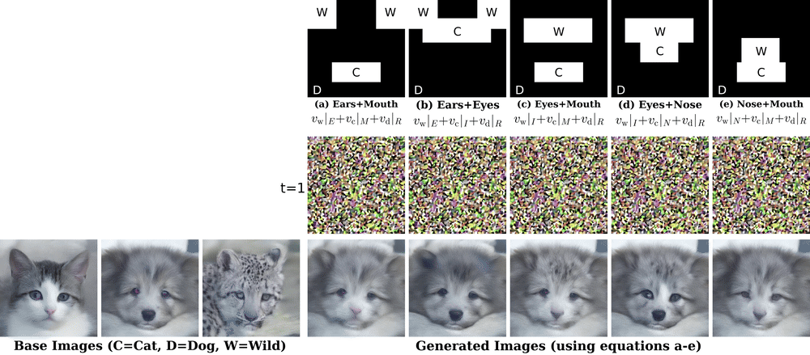
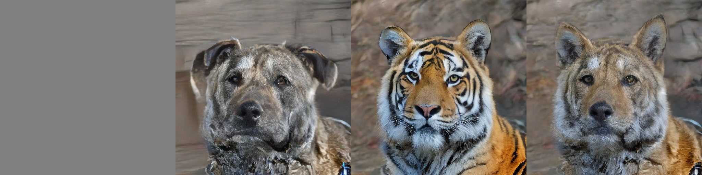
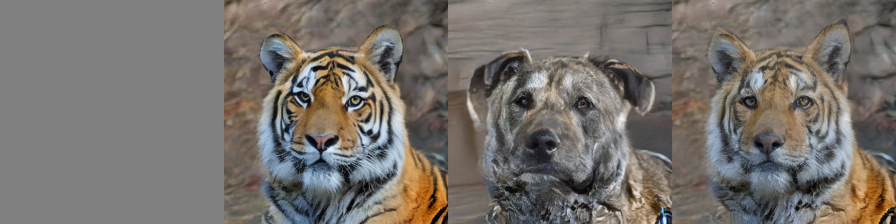
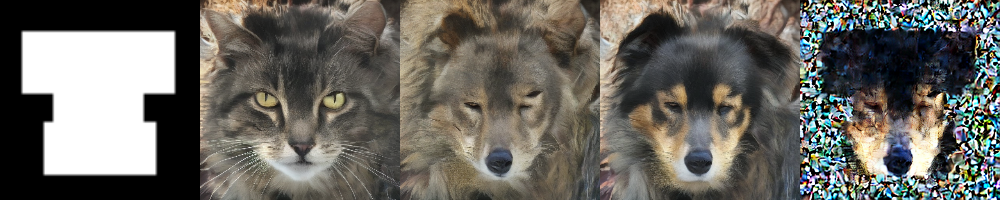
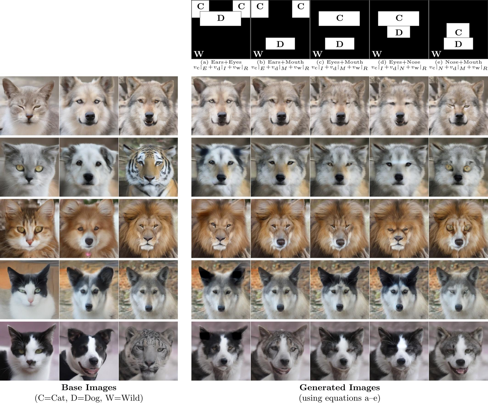

# Generative Anchored Fields: Controlled Data Generation via Emergent Velocity Fields and Transport Algebra (GAF)

Deressa Wodajo, Hannes Mareen, Peter Lambert, Glenn Van Wallendael

<br clear=all />   
<p align="center">
  
</p>

<br clear=all />
<br clear=all />

This repository contains the implementation code for **Generative Anchored Fields: Controlled Data Generation via Emergent Velocity Fields and Transport Algebra (GAF)** paper. Find the full paper on [arXiv ](https://arxiv.org/abs/2511.22693).


<p style="text-align: justify;">
GAF introduces algebraic compositionality to generative models. Instead of learning implicit class relationships, GAF provides explicit, mathematically guaranteed control over class composition through independent K-heads anchored to a shared origin J.
</p>


## GAF Model Architecture

The **GAF** model consists of a **Trunk** and two twin networks, **J (Noise Anchor)** and **K (Data Anchor)**.

Each K-head is an independent linear projection. Blending K-heads = blending endpoints in latent space. **Algebriac, not approxiamte.**


The code in this repository enables training and testing of the GAF model for image generation.

**Note:** This repository contains code from ongoing research. We are not accepting external contributions at this time.

## Table of Contents

- [Requirements](#requirements)
- [Usage](#usage)
  - [Model Training](#model-training)
  - [Model Testing](#model-testing)
  - [Metrics and Cyclic Transport](#metrics)
  - [Transport Algebra](#transport)
  - [Method Summary](#summary)
- [Results](#results)
  - [AFHQ 512 Editing](#afhqediting)
  - [ImageNet-256 Editing](#imagenet256editing)


## Requirements
<pre>
    * Python 3.10
    * PyTorch
    * CUDA >=11.8
    * tqdm, imageio
    * duffusers, timm, LPIPS
</pre>


## Usage

1. Clone this repository:

```bash
git clone https://github.com/IDLabMedia/GAF.git
```

2. Install the required dependencies:

```bash
pip install -r requirements.txt
```

## Model Training
To train the GAF model, follow these steps:

1. Prepare the training dataset. CIFAR-10 is trained on pixel space, and CelebA-256, AFHQ-512, and ImageNet-256 are trained on precomputed latent dataset.  
set ```precompute=true``` in the config file to precompile your dataset (found in the configs folder. Each dataset has its own config file, edit the params as needed).

2. Run the training script:

set ```precompute=false``` to train GAF on the precomputed dataset.

Example:

1. To train GAF from scratch:
    ```bash
      python train.py --data imagenet --image_size 256
    ```
2. Train using original DiT weights (Retrunking):

    You can load the original DiT model weights into the GAF **trunk** . 
    
    Download the weights from the [DiT github page](https://github.com/facebookresearch/DiT) and specify the weight path in the config file.
    
    set ```retrunk: downloaded_dit_weight_file_path```

    *Note: Depending on your batch size, setting iters between 20,000 and 100,000 is sufficient to generate high-quality images (we used 100,000 iterations).*

    ```bash
      python train.py --data imagenet --image_size 256 --retrunk
    ```
3. To resume training

    ```bash
      python train.py --data imagenet --image_size 256 --mode resume
    ```

## Model Testing
**Image Generation with GAF**

To generate images using the trained GAF model, follow these steps:


1. Download the pretrained models from [Huggingface](https://huggingface.co/Deressa/GAF/tree/main) and save it in the `weights` folder.

| Dataset   | Image Resolution  | FID-50K | Model Weight         | 
| ----------| ----------------- | --------|----------------------|
| CIFAR-10  | 32x32             | 9.53    |[GAF-CIFAR-B/2](https://huggingface.co/Deressa/GAF/blob/main/gaf_dit_cifar_32_768_12_12_p2_ckpt_ema_it0100000.pt)     |
| AFHQ      | 512x512           | --      |[GAF-AFHQ-XL/2](https://huggingface.co/Deressa/GAF/blob/main/gaf_dit_sd15_afhq_512_1152_28_16_p2_ckpt_ema_it0100000.pt)     |
| CelebA-HQ | 256x256           | 7.27    |[GAF-CelebA-XL/2](https://huggingface.co/Deressa/GAF/blob/main/gaf_dit_sd15_celeba_256_1152_28_16_p2_ckpt_ema_it0100000.pt.pt)   |
| ImageNet  | 256x256           | 7.51    |[GAF-ImageNet-XL/2](https://huggingface.co/Deressa/GAF/blob/main/gaf_dit_sd15_imagenet_256_1152_28_16_p2_allclasses_1000K_retrunk_ckpt_ema_it0100000.pt) |

### Pure Class Generation
```bash
python sampler.py --data imagenet --classes 979
```
**or**
```bash
python sampler.py --data imagenet --classes cliff
```

or generate multiple pure classes

```
python sampler.py --data imagenet --classes 979 984 321 
```

### Weighted Composition
Example: **v = 0.3 * v<sub>979</sub> + 0.7 * v<sub>984</sub>**
```bash
python sampler.py --data imagenet --classes 979 984 --weight 0.3 0.7
```

### Multi-Class Weighted Blend
Example: **v = 0.5 * v<sub>979</sub> + 0.3 * v<sub>984</sub> + 0.2 * v<sub>321</sub>**
```bash
python sampler.py --data imagenet --classes 979 984 321 --weight 0.5 0.3 0.2
```

### Permutation Exploration
Use the fixed weights [0.5, 0.3, 0.2], but rotate which class is assigned each weight.
```bash
python sampler.py --data imagenet --classes 979 984 321 --weight 0.5 0.3 0.2 --permute
```

### Spatial Composition with Built in Mask

2 class spatial composition using horizontal mask ( *_2 reperesents the number of class*). Top row region -> class 510, bottom row region -> class 984

```bash
python sampler.py --data imagenet --classes 510 984 --mask_tpye horizontal_2
```

3 class spatial composition. Top row region -> class 510, middle row region -> class 984, bottom row region -> class 979

```bash
python sampler.py --data imagenet --classes 510 984 979 --mask_tpye horizontal
```

with class permutuation

3 class spatial composition with mask region rotation. Top row region -> class 510, middle row region 984, bottom row region -> class 979

```bash
python sampler.py --data imagenet --classes 510 984 979 --mask_tpye horizontal --permute
```

### Spatial Composition with Custom Mask

2 class spatial composition with user provided mask. Top row region -> class 510, bottom row region -> class 984

```bash
python sampler.py --data imagenet --classes 510 984 --mask_img masks/contrainer.png --seed 42
```

### Spatial + Weighted

Spatial regions with per-class weights

```bash
python sampler.py --data imagenet --classes 510 984 --mask_img masks/ship.png --weight 0.8 0.5
```

### Scalar Alpha Blend (2 classes only)

**K = alpha * K<sub>1</sub> + (1-alpha) * K<sub>2</sub>** 

OR

**v = alpha * v<sub>1</sub> + (1-alpha) * v<sub>2</sub>**

```bash
python sampler.py --data afhq --classes 1 2 --alpha 0.6 --permute
```
The images shown are generated by the IER sampler
<br clear=all/>

**0.6 Dog + 0.4 Tiger**
<br clear=all/>


**0.4 Dog + 0.6 Tiger**
<br clear=all/>



## Sampler Arguments

| Argument | Type | Default | Description |
|----------|------|---------|-------------|
| `--data` | str | imagenet | Dataset: `imagenet`, `celeb`, `afhq`, `cifar` |
| `--classes` | int[] | required | Class indices |
| `--weight` | float[] | None | Weights per class (should sum to 1) |
| `--alpha` | float | None | Scalar blend ratio (2 classes only) |
| `--mask_type` | str | None | Preset mask layout |
| `--mask_img` | str | None | Path to custom mask image |
| `--steps` | int | 20 | Integration steps |
| `--solver` | str | euler | ODE solver: `endpoint`, `euler`, `heun`, `rk4` |
| `--seed` | int | 42 | Random seed |
| `--permute` | flag | False | Generate all class permutations |
| `--giffer` | flag | False | Save trajectory as GIF |
| `--skip` | flag | False | Skip pure class generation |
| `--h`, `--w` | int | 512 | Output dimensions |
| `--b` | int | 1 | Batch size |
| `--sigma` | float | 1.25 | Mask blur strength |

### Available Mask Types
```bash
python sampler.py --list_masks
```

`horizontal_2`, `vertical_2`, `radial_2`, `diagonal_2`, `horizontal`, `vertical`, `radial`, `diagonal`, `quadrant`, `horizontal_4`, `vertical_4`, `radial_4`, `custom`


suffix _2 -> 2 classes, suffix _4 and quadrant -> 4 classes, no suffix -> 3 classes

custom - custom mask image from disk

---

## <a id="metrics"></a>Metrics & Cyclic Transport (Stress Test GAF)

### Cyclic Interpolation
Smooth cyclic interpolation through K-heads and a shared J-head, returning to start:
```bash
python metrics.py --data imagenet --classes 979 984 321 --mode interpolation --steps 250 --n_interp 10
```

### Cyclic Transport (Closure Test)
Tests algebraic closure: `K1 -> J -> K2 -> J -> K3 -> J -> K1`
```bash
python metrics.py --data imagenet --classes 979 984 321 --mode cycle --steps 250
```

### Barycentric Interpolation (3 classes)
Generates grid of 3-way blends across simplex:
```bash
python metrics.py --data imagenet --classes 979 984 321 --mode barycentric --grid_size 7
```

---

## Metrics Arguments

| Argument | Type | Default | Description |
|----------|------|---------|-------------|
| `--ckpt` | str | required | Path to checkpoint |
| `--outdir` | str | required | Output directory |
| `--classes` | int[] | required | Classes for cycle/interpolation |
| `--mode` | str | None | `interpolation`, `barycentric`, `cycle` |
| `--steps` | int | 20 | Integration steps (250+ for high fidelity) |
| `--n_interp` | int | 10 | Interpolation frames per transition |
| `--grid_size` | int | 7 | Barycentric grid size (grid_size²) |
| `--h`, `--w` | int | 512 | Output dimensions |
| `--data` | str | imagenet | Dataset: `imagenet`, `afhq`  |

---

## <a id="transport"></a>Transport Algebra

### Velocity Composition
GAF's K-heads enable exact velocity composition:

**Weighted blend**
```python
v = 0.5 * gaf.velocity(x, t, y=class_1) + 0.3 * gaf.velocity(x, t, y=class_2) + 0.2 * gaf.velocity(x, t, y=class_3)
```
**Spatial composition**
```
v = mask_1 * gaf.velocity(x, t, y=class_1) + mask_2 * gaf.velocity(x, t, y=class_2)
```

**Weighted Spatial Composition**
```
v = w_1 * mask_1 * gaf.velocity(x, t, y=class_1) + w_2 * mask_2 * gaf.velocity(x, t, y=class_2)
```


### Cyclic Closure
The transport algebra guarantees:
```
K₁ -> J -> K₂ -> J -> K₃ -> J -> K₁ = Identity
```

### Permutation Grid (3 classes, 6 permutations)
```bash
python sampler.py --data imagenet --classes 979 984 321 --weight 0.5 0.3 0.2 --permute --seed 42
```
Output: 6 rows showing same weights applied to different class orderings.

### Evolution GIF
```bash
python sampler.py --data imagenet --classes 979 984 --weight 0.3 0.7 --giffer
```
Output: GIF showing noise -> image trajectory.

---

## <a id="summary"></a> Method Summary

| Mode | Condition | Formula | Use Case |
|------|-----------|---------|----------|
| Pure | K=1 or no args | `v = v_k` | Single class generation |
| Scalar Blend | K=2 + `--alpha` | `v = alpha*v1 + (1-alpha)*v2` | Simple interpolation |
| Weighted | `--weight` | `v = Σ w_i*v_i` | Multi-class blend |
| Spatial | `--mask_img` | `v = Σ mask_i*v_i` | Region-based composition |
| Spatial+Weighted | both | `v = Σ w_i*mask_i*v_i` | Full control |


## <a id="afhqediting"></a>AFHQ-512 Editing

We perform multi-class spatial editing by composing the velocity fields for each class.

**Example:** $v = v_{\mathrm{c}}|_{E} + v_{\mathrm{d}}|_{I} + v_{\mathrm{w}}|_{R}$

Where:
* $v_{\mathrm{c}}|_{E}$: Velocity towards the **Cat** (restricted to the **Ear** mask).
* $v_{\mathrm{d}}|_{I}$: Velocity towards the **Dog** (restricted to the **Eye** mask).
* $v_{\mathrm{w}}|_{R}$: Velocity towards the **Wild** image (restricted to the **Rest** of the image, i.e., $R=1 - (E \cup I)$).

>**Note:** This composition is applied during the generation process (at the velocity level), not by blending the finished images. 

The "Base Images" shown on the grid are provided only as a reference, showing the outcome when the velocity is directed exclusively towards the cat, dog, or wild class.

Generate a dog with an eye of a cat
(use ```--permute``` to generate a cat with an eye of a dog)
```bash
python sampler.py --data afhq --classes 0 1 --mask_type afhq --image_size 512 --regions eye
```

Generate a wild with a mouth of a cat and an ear of a dog
```bash
python sampler.py --data afhq --classes 0 1 2 --mask_type afhq --image_size 512 --regions mouth ears
```
Skip generating the base classes
```bash
python sampler.py --data afhq --classes 1 0 2 --mask_type afhq --image_size 512 --regions eyes ears --skip
```
Explore all combinations with current region (nose, eyes)
```bash
python sampler.py --data afhq --classes 2 0 1 --mask_type afhq --image_size 512 --regions nose eyes --permute --giffer
```

Generate only specific regions. Currently implemented for AFHQ model, and accepts exactly three regions to work.
```bash
python sampler.py --data afhq --classes 2 0 1 --mask_type afhq --image_size 512 --regions eyes nose mouth --permute --giffer
```
*This command generates wild eyes, a cat nose, and a dog mouth. The rest remains noise since the velocity field only flows toward masked regions.*




<p align="center">
  
</p>

<br clear="all"/>

## <a id="imagenet256editing"></a>ImageNet-256 Editing

$
\begin{aligned}
\textbf{Example: } v &= v_{\mathrm{512}}|_{mask1} + v_{\mathrm{985}}|_{mask2} \\
\end{aligned}
$

where $mask2 = 1 - mask1$

* $v_{\mathrm{512}}|_{mask1}$: Velocity towards class 512 (restricted to mask1 region).
* $v_{\mathrm{985}}|_{mask2}$: Velocity towards class 985 (restricted to mask2 region).

$
\begin{aligned}
\textbf{Example: Editing with custom mask: } v &= v_{\mathrm{985}}|_{mask1} + v_{\mathrm{512}}|_{mask2}
\end{aligned}
$
                   
<p align="center">
  
</p>

<br clear=all>

## Citation

```bibtex
@article{deressa2025generativeanchoredfieldscontrolled,
      title={Generative Anchored Fields: Controlled Data Generation via Emergent Velocity Fields and Transport Algebra}, 
      author={Deressa Wodajo Deressa and Hannes Mareen and Peter Lambert and Glenn Van Wallendael},
      year={2025},
      journal={arXiv preprint arXiv:2511.22693}
}
```

---

<br clear=all>

## Acknowledgement
This work was funded in part by the Research Foundation Flanders (FWO) under Grant G0A2523N, IDLab
(Ghent University-imec), Flanders Innovation and Entrepreneurship (VLAIO), and the European Union.

## License

MIT License
